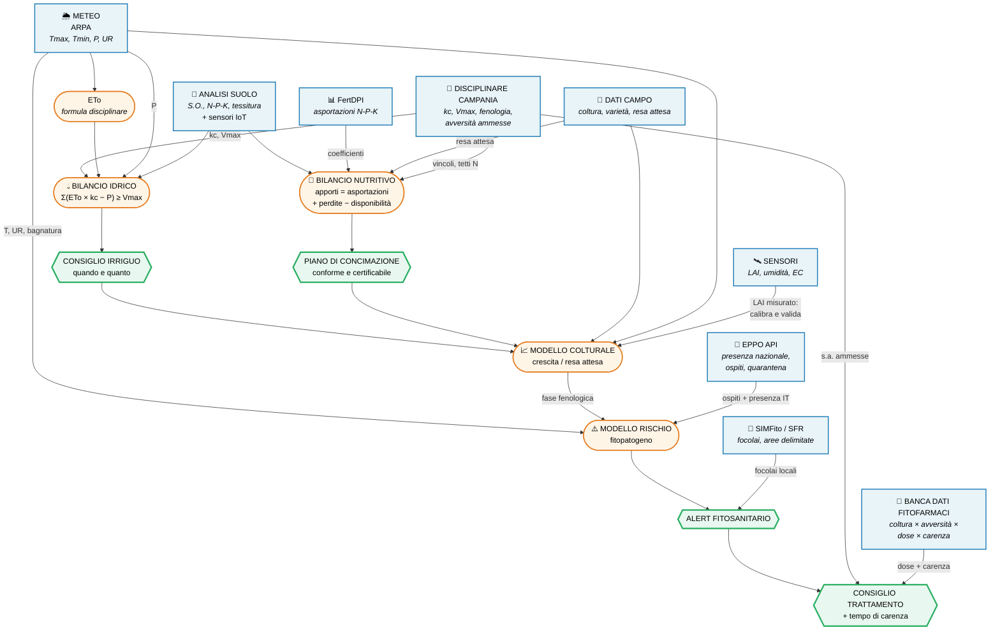

> [!abstract] Scopo del documento Mappare **quali dati esistono**, **in che formato**, e **come si incrociano** per costruire i moduli di calcolo (irrigazione, fertilizzazione) e di analisi previsionale (rischio fitopatogeni). Non è una specifica tecnica: è la base per la sessione di design con il team.

> [!info] Perimetro Ci concentriamo sulla **Campania**. Alcune fonti sono nazionali o europee e valgono ovunque; dove il dato è regionale, lo segnaliamo.

---

## 0. Riepilogo esecutivo

|Blocco dati|Formato migliore disponibile|Sforzo|Note|
|---|---|---|---|
|**Meteo**|API|🟢 —|Gestito da ARPA, **fuori dal nostro scope**|
|**Kc + ETo (irrigazione)**|FAO56 (web) + disciplinari (PDF)|🟢 basso|⚠️ vedi trappola formula ETo|
|**Fabbisogni N/P/K per coltura**|**Excel** (FertDPI Emilia-Romagna)|🟢 quasi zero|Base nazionale, riusabile|
|**Anagrafica fitofarmaci**|**CSV / JSON / XML** open data|🟢 basso|Ma **non** contiene gli impieghi|
|**Impieghi: coltura × avversità × dose × carenza**|PDF etichette **oppure** licenza commerciale|🔴 alto / €€|**Decisione aperta**|
|**Anagrafica fertilizzanti**|Web (Registro SIAN)|🟡 medio|Bassa priorità|
|**Disciplinari Campania (difesa)**|**PDF**|🔴 parsing|Nessuna alternativa|
|**Organismi nocivi / quarantena**|**API REST**|🟢 basso|→ vedi nota dedicata EPPO|
|**Parametri modelli colturali**|**YAML**|🟢 basso|Per la parte previsionale|
|**LAI tabulato per specie**|❌ **non esiste**|—|È un dato **misurato**, non di riferimento|

---

## 1. Meteo

**Fuori dal nostro scope.** I dati meteo (storico e real-time) vengono forniti da **ARPA**, come confermato dal team di sviluppo.

Serve però allinearsi su **quali variabili** ci arrivano, perché i moduli a valle ne dipendono:

- `Tmax`, `Tmin` giornaliere → **obbligatorie** (servono al calcolo ETo, vedi §2)
- Precipitazioni (`P`) → **obbligatorie** (bilancio idrico)
- Umidità relativa, bagnatura fogliare → utili per i modelli previsionali di malattia
- Radiazione solare → utile per i modelli di crescita

> [!warning] Da verificare con ARPA Se ARPA fornisce già un **ET0 calcolato**, va chiesto **con quale formula**. Vedi §2: usare l'ET0 sbagliato invalida tutto il calcolo irriguo.

---

## 2. Irrigazione — Kc ed ETo

### Il coefficiente colturale (Kc)

Il **Kc** è il moltiplicatore che trasforma l'evapotraspirazione di riferimento (`ETo`, uguale per tutti) nell'evapotraspirazione della **specifica coltura** (`ETc`), variabile lungo il ciclo fenologico.

```
ETc = ETo × Kc
```

### Due fonti, con priorità diversa

**A. Disciplinari di Produzione Integrata della Campania — FONTE UFFICIALE** Ogni scheda di coltura contiene già:

- la **tabella dei `kc` per fase fenologica**
- il **`Vmax`** (volume massimo di adacquamento, m³/ha)
- la **formula ETo da usare**

Formato: **PDF**. Va estratto.

**B. FAO Irrigation and Drainage Paper 56** (Allen et al., 1998) — FALLBACK Disponibile integralmente e gratuitamente online: `https://www.fao.org/4/x0490e/` Contiene, tabulati per circa 100 colture:

- `Kc_ini`, `Kc_mid`, `Kc_end`
- durate standard delle fasi fenologiche
- profondità radicale, fattore di deplezione `p`, altezza coltura
- `Kcb` (versione "dual", separa traspirazione ed evaporazione del suolo)

Da usare **solo** per le colture non coperte dal disciplinare campano. Trascrizione in CSV/JSON: mezza giornata di lavoro.

### 🚨 LA TRAPPOLA — leggere prima di scrivere codice

Il disciplinare della Campania prescrive **questa** formula per l'ETo:

```
ETo = (9,862 + 15,120 × Tmax − 9,028 × Tmin) / 1000
```

E la regola operativa:

```
si irriga quando   Σ (ETo × kc − P)   ≥   Vmax
```

> [!danger] Non mescolare le due ETo Quella **non è** la Penman-Monteith FAO. È una formula semplificata che usa **solo Tmax e Tmin**. I `kc` del disciplinare campano sono **calibrati su quella ETo lì**.
> 
> Se si prendono i `kc` del disciplinare e li si moltiplica per un `ET0` calcolato con Penman-Monteith (quello che restituiscono di default Open-Meteo, ARPA e la maggior parte delle API meteo), **il risultato è numericamente sbagliato e non conforme al disciplinare**.
> 
> È un errore che non si vede in sviluppo e che esplode in fase di certificazione SQNPI.
> 
> **Regola: la coppia `(ETo, kc)` deve provenire dalla stessa fonte.**

Lato positivo: la formula campana richiede solo `Tmax` e `Tmin`, che abbiamo comunque da ARPA. Implementarla è banale.

---

## 3. Fertilizzazione

### ✅ Il fabbisogno per coltura esiste già in Excel

Il dato chiave (**asportazioni / assorbimenti unitari di N, P, K per coltura**) **non va estratto dai PDF**. È già pubblicato in formato foglio di calcolo:

|Fonte|File|Formato|
|---|---|---|
|**Regione Emilia-Romagna**|**FertDPI** (ed. 2026, ~605 KB)|**Excel**|
|Regione Veneto|Foglio di calcolo fabbisogni nutrizionali|**`.xlsm`**|

Entrambi implementano i due metodi previsti dai disciplinari:

1. **Metodo del bilancio** (analitico)
2. **Metodo delle schede a dose standard** (semplificato)

### Perché vale anche per la Campania

I coefficienti **non sono un'invenzione regionale**: derivano dalle **Linee Guida Nazionali di Produzione Integrata — Sezione Tecniche Agronomiche**.

La Campania dichiara esplicitamente che i propri disciplinari sono redatti _in conformità alle Linee Guida Nazionali di Produzione Integrata vigenti_, secondo le modalità previste dal **SQNPI**.

> [!tip] Strategia consigliata Usare **FertDPI dell'Emilia-Romagna come struttura dati di partenza** (è già un modello di calcolo funzionante e validato), poi verificare e sovrascrivere solo i valori dove la _Guida alla concimazione_ della Campania si discosta. Ci si risparmia il 90% del lavoro di modellazione.

### Il bilancio dell'azoto — la logica da implementare

```
Apporti = Perdite

Apporti  = concimazioni + disponibilità naturali del suolo (mineralizzazione S.O.)
           + precessione colturale
Perdite  = asportazioni della coltura + lisciviazione + immobilizzazione
```

Input necessari:

- **analisi del suolo** (obbligatoria, validità 5 anni) → tessitura, S.O., N, P, K, pH, calcare
- **resa attesa** della coltura
- **coefficienti di asportazione** ← FertDPI
- **precipitazioni cumulate invernali** (per stimare la lisciviazione dell'azoto)

> [!note] Vincoli normativi da codificare Esistono tetti massimi non superabili (es. limiti di N efficiente per ettaro/anno, più restrittivi nelle **Zone Vulnerabili ai Nitrati**). Vanno implementati come **hard constraint**, non come suggerimento.

### Anagrafica dei prodotti fertilizzanti

**Registro dei Fertilizzanti (SIAN)** — `sian.it/vismiko` — circa 40.000 prodotti registrati. Consultazione web, **nessuna API**. Priorità bassa: serve solo quando si passa dal "quanti kg di N" al "quale sacco comprare".

---

## 4. Fitofarmaci — ⚠️ il blocco critico

### Cosa c'è di aperto

**Banca Dati del Ministero della Salute** (`fitosanitari.salute.gov.it`)

- ~17.400 prodotti, **aggiornata quotidianamente**
- Open data su `dati.salute.gov.it` in **CSV** (per alcuni dataset anche **JSON** e **XML**)
- Licenza **IODL 2.0** — riuso libero

**Contenuto del dataset**: numero di registrazione, denominazione, data di registrazione, scadenza autorizzazione, indicazione di pericolo, attività (insetticida/fungicida/…), formulazione, importazioni parallele, sostanze attive contenute, dati dell'impresa titolare.

### 🚨 Cosa NON c'è

> [!danger] Il dato che ci serve non è nell'open data Il dataset ministeriale è un'**anagrafica**. Non contiene:
> 
> - ❌ la **coltura** su cui il prodotto è ammesso
> - ❌ l'**avversità** che controlla
> - ❌ la **dose**
> - ❌ il **tempo di carenza** (intervallo di sicurezza)
> 
> Tutte queste informazioni esistono **solo dentro l'etichetta**, che è un **PDF** allegato al singolo prodotto.

### E l'Europa?

**EU Pesticides Database** — ha download e API, ma fornisce: sostanze attive approvate, **MRL** e autorizzazioni d'emergenza (art. 53 Reg. 1107/2009).

> [!important] MRL ≠ tempo di carenza
> 
> - **MRL** = limite massimo di residuo _nell'alimento_ (mg/kg) — europeo
> - **Tempo di carenza** = giorni tra ultimo trattamento e raccolta — **specifico del singolo formulato, nazionale**
> 
> Sono due cose diverse. Il secondo **non si trova a livello UE**.

### Le due strade — DECISIONE APERTA

**Strada A — Licenza commerciale** Esistono fornitori che hanno già digitalizzato le etichette e offrono integrazione dati per piattaforme di agricoltura digitale:

- **BDF srl** (`bdfsrl.it`) — dichiara di digitalizzare colture e avversità, dosi e modalità d'impiego, intervalli di sicurezza e fasce di rispetto, con servizio di integrazione dati
- **Fitogest / Image Line** (`fitogest.imagelinenetwork.com`)

**Strada B — Parser interno sui PDF delle etichette**

> [!warning] Il costo vero è il mantenimento, non lo sviluppo Non si tratta di parsare 17.000 PDF una volta. Le etichette cambiano **in continuazione**: revoche, nuove registrazioni, variazioni delle condizioni d'impiego, deroghe territoriali (in Campania ne escono diverse ogni stagione). Un parser va **mantenuto vivo**, e ogni cambio di layout lo rompe.

➡️ **Da decidere in sessione con il team. È il singolo punto che più impatta tempi e costi del WP.**

---

## 5. Disciplinari di Produzione Integrata — Campania

**Stato**: approvati con **DRD n. 30 del 24 marzo 2026** (BURC n. 16 del 30/03/2026). **Formato**: **PDF**. Nessun Excel, nessuna API.

**Struttura in tre blocchi**:

1. **Norme tecniche generali** — include la **Guida alla concimazione** (→ §3) e i parametri irrigui (→ §2)
2. **Norme tecniche di coltura** — scheda per coltura (fenologia, `kc`, `Vmax`, resa, raccolta)
3. **Norme tecniche per la difesa e il diserbo integrato** — **una scheda per coltura**: avversità → sostanze attive ammesse → vincoli e limitazioni

Il blocco 3 è quello che, incrociato con la banca dati fitofarmaci, produce il **consiglio di trattamento conforme**.

> [!tip] Fallback previsto dalla norma Il SQNPI (punto 5.1) prevede che **se una coltura non è presente nel disciplinare della Campania, si può adottare la corrispondente parte del disciplinare di una Regione confinante**. Utile sia per coprire i buchi, sia come giustificazione formale per riusare le tabelle di altre regioni.

---

## 6. Organismi nocivi — EPPO

Coperto da documentazione dedicata. → **[[EPPO API]]**

In sintesi, ai fini dello schema di incrocio:

- **API REST**, gratuita, base URL `https://api.eppo.int/gd/v2`
- Fornisce: anagrafica organismo, piante ospiti, tassonomia, stato di quarantena, **presenza a livello di Paese**, Reporting Service (alert)
- ⚠️ **Non scende a livello regionale**: per la Campania serve **SIMFito / Servizio Fitosanitario Regionale** (aree delimitate, focolai, bollettini) → **PDF/web, parsing**
- 🔑 **L'`eppocode` è la chiave di join** tra tutte le fonti

---

## 7. Analisi previsionale — parametri dei modelli colturali

Per la parte di **simulazione e previsione** (non solo monitoraggio), esiste una base già machine-readable:

**`github.com/ajwdewit/WOFOST_crop_parameters`**

- Set di parametri del modello colturale **WOFOST** (Wageningen)
- **Formato YAML**, già parsabile
- Organizzati **per coltura e per varietà** (frumento, mais, patata, girasole, soia, riso…)
- Ogni parametro ha **valore, descrizione e unità di misura**
- Include: dinamica del LAI, traspirazione massima, concentrazioni max di N/P/K nelle foglie per fase di sviluppo

Utilizzabile via **PCSE** (Python Crop Simulation Environment).

### 🚫 Sul LAI — chiarimento necessario

> [!important] Non esiste una "tabella LAI per specie agricola" Il **LAI non è un parametro di riferimento tabulato**. È una **variabile misurata**: dipende da coltura, varietà, densità d'impianto, fase fenologica, stress idrico e nutrizionale.
> 
> Conferma indiretta: in FAO56 il LAI compare come **input per correggere il Kcb**, non come valore tabulato in uscita.
> 
> **Nel nostro sistema il LAI è un dato di campo** — è ciò che misuriamo con il sensore multispettrale. Non è qualcosa da cercare in un database.
> 
> Se serve un LAI _atteso_ per fare anomaly detection, il riferimento sono i **parametri WOFOST** sopra, non una tabella.

---

## 8. Schema di incrocio dei dati

Come i pezzi si combinano per produrre output utili all'agricoltore.



### Lettura dello schema — le catene principali

**1️⃣ Catena irrigua** `Meteo (Tmax, Tmin) → ETo → × kc (disciplinare) − P → confronto con Vmax → CONSIGLIO IRRIGUO` _Il Kc è il ponte tra il meteo generico e la specifica coltura._

**2️⃣ Catena nutritiva** `Analisi suolo + resa attesa + asportazioni (FertDPI) → bilancio N-P-K → PIANO DI CONCIMAZIONE` _Vincolato dai tetti massimi del disciplinare e dalla normativa nitrati._

**3️⃣ Catena produttiva** `Irrigazione + Fertilizzazione + Coltura + Meteo → MODELLO COLTURALE → resa attesa e fase fenologica` _Qui il **LAI misurato dai sensori** entra come **validazione**: se il LAI reale diverge da quello previsto, c'è uno stress che il modello non ha visto._

**4️⃣ Catena fitosanitaria** `Meteo (T, UR, bagnatura) + fase fenologica → modello di rischio` `× ospiti e presenza (EPPO) × focolai locali (SIMFito) → ALERT` `+ sostanze ammesse (disciplinare) + dose e carenza (banca dati) → CONSIGLIO TRATTAMENTO`

> [!tip] Il punto di incontro delle catene **La fase fenologica è il vero hub del sistema.** Determina il `kc` (irrigazione), la finestra di concimazione, la suscettibilità alle avversità e la finestra di trattamento. Se il modello fenologico è sbagliato, sbagliano _tutti_ i moduli a valle. → Merita di essere trattato come componente di prima classe, non come un dettaglio.

> [!note] Il tempo di carenza chiude il cerchio È l'unico dato che collega la **difesa** alla **raccolta**: determina se un trattamento è ancora ammissibile data la data di raccolta prevista (che arriva dal modello colturale). È anche il dato **più difficile da ottenere** (§4). Non è un caso.

---

## 9. Punti aperti

- [ ] **Fitofarmaci: licenza commerciale o parser interno?** ← _blocca il resto della catena 4_
- [ ] Verificare **quale ET0** fornisce ARPA (e con quale formula)
- [ ] Estrarre `kc` / `Vmax` / fenologia dai PDF dei disciplinari Campania
- [ ] Scaricare e analizzare la struttura di **FertDPI** (Emilia-Romagna)
- [ ] Verificare se **SIMFito** espone un'API (non documentata pubblicamente)
- [ ] Confermare la lista delle **colture target** per la Campania (restringe tutto il lavoro di estrazione)

---

## 10. Fonti

|Fonte|URL|Formato|
|---|---|---|
|Disciplinari PI Campania|`agricoltura.regione.campania.it/difesa/disciplinari.html`|PDF|
|Servizio Fitosanitario Campania|`agricoltura.regione.campania.it/difesa/difesa.html`|Web|
|SIMFito|`simfito.regione.campania.it`|Web|
|FertDPI Emilia-Romagna|`agricoltura.regione.emilia-romagna.it` → Suolo e fertilizzazione|Excel|
|Disciplinari Veneto (+ .xlsm)|`regione.veneto.it/web/fitosanitario/difesa-integrata`|PDF + xlsm|
|Banca Dati Fitosanitari (Min. Salute)|`fitosanitari.salute.gov.it`|Web + dataset|
|Open Data Fitosanitari|`dati.salute.gov.it/it/dataset/fitosanitari/`|CSV / JSON / XML|
|EU Pesticides Database|`food.ec.europa.eu/plants/pesticides/eu-pesticides-database_en`|Download + API|
|Registro Fertilizzanti SIAN|`sian.it/vismiko`|Web|
|FAO Irrigation & Drainage Paper 56|`fao.org/4/x0490e/`|Web (HTML)|
|WOFOST crop parameters|`github.com/ajwdewit/WOFOST_crop_parameters`|YAML|
|EPPO Global Database API|`api.eppo.int/gd/v2` → **[[EPPO API]]**|REST / JSON|
|BDF (commerciale)|`bdfsrl.it`|Integrazione dati|
|Fitogest (commerciale)|`fitogest.imagelinenetwork.com`|Web / ZIP|